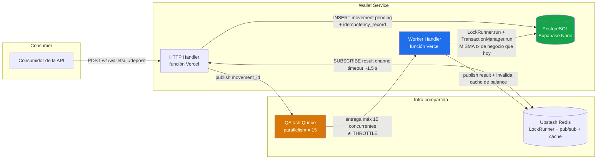
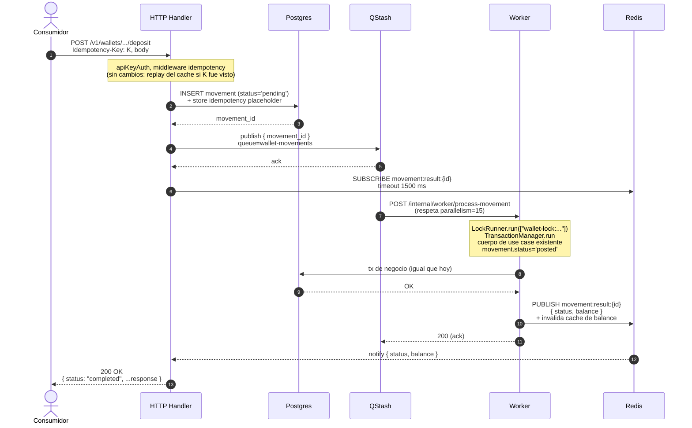
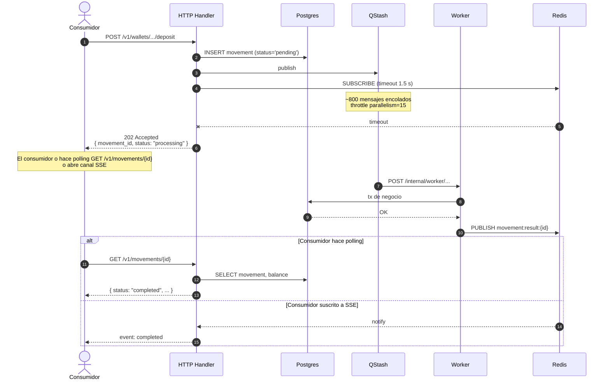
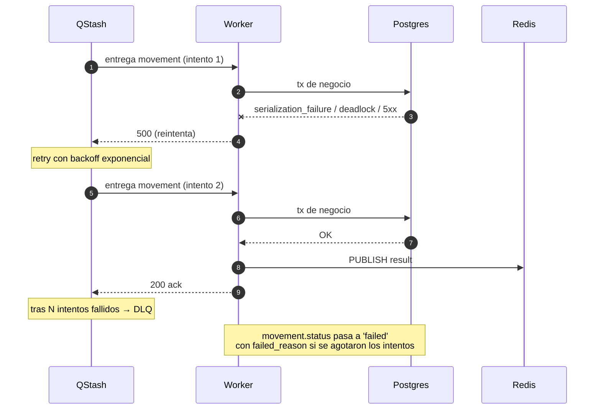

# Plan de procesamiento asíncrono de alta concurrencia

## Objetivo

Tolerar picos de **~1000 movimientos concurrentes** (depósitos, retiros, transferencias, ajustes, capturas de hold, charges) sobre el stack de infra actual:

- **Vercel** (funciones serverless)
- **Supabase Nano** (Postgres: 200 conexiones máx, pool de 40, CPU modesta)
- **Upstash QStash** (ya en uso)
- **Upstash Redis** (ya en uso por `LockRunner`)

sin:

- Saturar el pool de conexiones de Postgres
- Tumbar la base de datos bajo carga sostenida
- Devolver errores a los consumidores de la API
- Romper las garantías transaccionales / de consistencia
- Producir movimientos duplicados o perdidos

Este documento describe **el cambio arquitectural, qué cambia respecto al estado actual, el plan de migración y el razonamiento de capacidad** que demuestra que el diseño aguanta en infraestructura tier Nano.

---

## Resumen ejecutivo

El wallet **ya tiene el 80% del camino hecho**. Doble entrada contable, idempotencia, locking distribuido en Redis, optimistic locking sobre `wallet.version`, sharding de system wallets y el agregado `Movement` ya existen hoy. El cuello de botella es puramente **el manejo síncrono de requests**: cada mutación HTTP retiene una conexión de Postgres durante toda la transacción de negocio (advisory lock + ledger writes + bump de versión), y 1000 de esas concurrentes saturan el pool.

La solución es **insertar una cola entre la API y la transacción de negocio**, con un **worker de concurrencia controlada** procesando la cola. La lógica transaccional **no cambia** — solo se ejecuta en otro proceso a un ritmo controlado. Los consumidores experimentan el cambio como una **respuesta que parece síncrona** cuando la cola se drena rápido, y como un **202 Accepted con un handle del movimiento** durante picos reales.

Sin rewrite del modelo de datos. Sin event sourcing. Sin partir en microservicios. Mismo Postgres. Mismo Prisma. Mismo `LockRunner`. Mismo `TransactionManager`.

---

## Estado actual (lo que ya está en pie)

| Capacidad | Estado | Dónde |
|---|---|---|
| Ledger de doble entrada, append-only, protegido por trigger | ✅ | `LedgerEntry`, `prisma/immutable_ledger.sql` |
| Agregado `Movement` (agrupa débito + crédito + transacciones) | ✅ | `Movement` |
| Idempotencia en el borde de la API (UNIQUE por `(key, platform_id)`) | ✅ | `IdempotencyRecord`, `src/common/idempotency`, middleware |
| Lock distribuido por wallet (Redis) | ✅ | `LockRunner`, `src/utils/application/lock.runner.ts` |
| Ordenamiento de locks multi-wallet (sin deadlocks A↔B) | ✅ | `LockRunner` (sort + dedupe) |
| Optimistic locking sobre `wallet.version` | ✅ | `Wallet`, `TransactionManager` |
| Aislamiento Serializable + retry con backoff | ✅ | `TransactionManager` (5 reintentos, jitter) |
| Sharding de system wallets (32 shards por defecto) | ✅ | `systemWalletShardIndex`, `ensureSystemWalletShards` |
| Arquitectura hexagonal, CQRS, command/query buses | ✅ | `src/wallet/...` |

**Estos son los cimientos de un sistema financiero profesional, y los mantenemos todos.** El plan a continuación no toca nada de esto excepto para envolver el cuerpo de las use cases existentes dentro de un worker disparado por una cola.

---

## Qué falta (el gap real)

| Gap | Efecto hoy | Efecto a 1000 concurrentes |
|---|---|---|
| Todos los endpoints mutadores ejecutan la transacción completa inline | Cada request retiene 1 conexión del pool durante toda la tx (~50–150 ms) | 40 slots × ~75 ms ≈ ~530 req/seg **sostenidos** de capacidad; los bursts encima se encolan en Vercel y hacen timeout |
| No hay throttle de concurrencia por debajo de la capa API | Vercel escala handlers, todos intentan tomar una conexión de Postgres a la vez | Pool exhausted → `Too many connections` → errores 5xx |
| `Movement` no tiene estado de ciclo de vida (sin `pending` / `processing` / `posted` / `failed`) | OK para flujo sync | No se puede representar un movimiento aceptado pero aún no commiteado |
| No hay mecanismo para publicar el resultado de un movimiento a un caller en espera | OK para flujo sync | No se puede implementar la "ilusión síncrona" ni notificar completion a un cliente que hace polling |
| No hay path de worker / consumer | N/A | No hay forma de throttlear la tasa a la que la DB ve transacciones de negocio |

Nota: intentar escalar esto con Prisma Accelerate o cualquier otro pooler **no arregla la causa raíz** — el pool no es el límite; la capacidad de la DB para procesar transacciones de negocio concurrentes en Nano sí lo es. Un pooler redistribuye conexiones; no crea capacidad de DB.

---

## Arquitectura objetivo



**Invariante clave:** el worker ejecuta **exactamente el mismo cuerpo de use case** que ejecuta el handler hoy (`LockRunner.run(...) → TransactionManager.run(...) → lógica de dominio → escrituras Prisma`). La transacción en sí no cambia. La única diferencia estructural es **dónde se ejecuta** y a **qué concurrencia**.

### El "throttle"

`parallelism = 15` es una configuración a nivel de queue en QStash. QStash entregará a lo sumo 15 requests HTTP concurrentes al endpoint del worker, sin importar cuántos mensajes haya en la cola. Los mensajes restantes esperan dentro de QStash. Se configura una vez a nivel del wallet; invisible para los consumidores.

### Por qué encaja con la arquitectura existente

- `LockRunner.run` y `TransactionManager.run` se mueven del handler al worker. Su contrato no cambia.
- `IdempotencyStore` conserva su rol actual en el handler (dedupe HTTP-level de requests idénticos por `Idempotency-Key` + `platform_id`).
- Los comandos y queries siguen fluyendo a través de `ICommandBus` / `IQueryBus`. El worker despacha comandos igual que los handlers hoy.
- No hay eventos cross-BC. La cola es **interna al BC de wallet** — es un mecanismo de entrega para procesar los propios comandos del wallet, no un evento de integración. Esto es compatible con la regla del proyecto "no Event-Driven integration between BCs".

---

## Diagramas de secuencia

### Happy path (ilusión síncrona, rápido)



### Slow path (pico, fallback async)



### Path de fallo (retry + DLQ)



---

## Qué cambia respecto al estado actual

### 1. Dominio: agregar ciclo de vida a `Movement`

`Movement` hoy es un journal entry finalizado. La nueva máquina de estados refleja el flujo async:

```
pending → processing → posted
                    ↘ failed
                    ↘ reversed (semántica existente)
```

- `pending`: el handler insertó el movimiento; el worker aún no lo tomó.
- `processing`: el worker tomó el mensaje y está ejecutando la tx de negocio.
- `processing`: el worker tomó el mensaje y está ejecutando la tx de negocio.
- `posted`: la tx de negocio commiteó correctamente. **Equivalente a todos los movimientos actuales.**
- `failed`: el worker agotó los reintentos; no se escribieron ledger entries. (Invariante: un movimiento con `status='failed'` tiene cero filas en `LedgerEntry`.)
- `reversed`: semántica sin cambios (chargeback, reversión manual, etc.).

### 2. Cambios de schema (Prisma)

Una sola columna nueva en `movements`, más un índice por status:

```prisma
model Movement {
  id            String        @id
  type          String
  reason        String?
  /// NUEVO
  status        String        @default("posted")
  /// NUEVO
  failedReason  String?       @map("failed_reason")
  createdAt     BigInt        @map("created_at")

  transactions  Transaction[]
  ledgerEntries LedgerEntry[]

  @@index([status, createdAt])
  @@map("movements")
}
```

SQL de la migración:

```sql
ALTER TABLE movements
  ADD COLUMN status text NOT NULL DEFAULT 'posted',
  ADD COLUMN failed_reason text;

CREATE INDEX movements_status_created_at_idx
  ON movements(status, created_at);
```

**El default `'posted'` garantiza que cada fila existente sea correcta sin necesidad de backfill** (los movimientos existentes ya commitearon todos sus ledger entries — por definición, están posted).

### 3. Nueva superficie de código

```
src/wallet/
  domain/
    movement.aggregate.ts           ← agregar transiciones de status, factory `pending()`
    movement.errors.ts              ← MOVEMENT_NOT_FOUND, MOVEMENT_ALREADY_PROCESSED, ...
    ports/
      movement.repository.ts        ← writes para el nuevo flujo de status
      result.publisher.ts           ← NUEVO PUERTO: publica resultado + invalida cache
      movement.queue.publisher.ts   ← NUEVO PUERTO: encola procesamiento del movimiento
  application/
    command/
      enqueue-movement/             ← NUEVO: inserta Movement pending + publica a queue
      process-movement/             ← NUEVO: use case del worker (delega a las use cases existentes de deposit/withdraw/.../charge)
    query/
      get-movement/                 ← NUEVO (o extender): para polling del status
  infrastructure/adapters/
    inbound/http/
      movements/                    ← NUEVOS endpoints: GET /v1/movements/{id}, GET /v1/movements/{id}/events (SSE)
      <endpoints existentes>        ← refactorizados: enqueue + wait-or-202 en vez de ejecución inline
    inbound/worker/
      process-movement.handler.ts   ← NUEVO: recibe webhook firmado de QStash
    outbound/
      qstash/
        qstash.queue.publisher.ts   ← NUEVO adapter para IMovementQueuePublisher
      redis/
        redis.result.publisher.ts   ← NUEVO adapter para IResultPublisher
        redis.balance.cache.ts      ← NUEVO (opcional, Fase 4)
```

### 4. Handlers: de "ejecutar" a "encolar + esperar"

**Hoy (ilustrativo):**

```ts
// dentro del handler POST /v1/wallets/:id/deposit
const result = await commandBus.dispatch(ctx, new DepositCommand(...));
return c.json(result, 200);
```

**Objetivo:**

```ts
const { movementId } = await commandBus.dispatch(
  ctx,
  new EnqueueMovementCommand({ type: "deposit", payload: ... })
);

const result = await resultSubscriber.waitFor(ctx, movementId, { timeoutMs: 1500 });

if (result.status === "completed") {
  return c.json(result.body, 200);
}
return c.json({ movement_id: movementId, status: "processing" }, 202);
```

`EnqueueMovementCommand` ejecuta **una sola** escritura pequeña a Postgres (`INSERT INTO movements (status='pending')`) y publica a QStash. En el peor caso retiene una conexión ~5–10 ms.

### 5. Endpoint del worker

```
POST /internal/worker/process-movement
  Body: { movement_id }
  Auth: verificación de firma QStash (header Upstash-Signature)
```

El worker:

1. Valida la firma de QStash (rechaza llamadas no autenticadas).
2. Carga el agregado `Movement`; si `status != 'pending'`, ack y retornar (idempotente — ya procesado o en proceso en otra parte).
3. Transiciona `pending → processing` en un update pre-tx pequeño.
4. Despacha el comando apropiado (`DepositCommand`, `WithdrawCommand`, `TransferCommand`, `CaptureHoldCommand`, `AdjustmentCommand`, `ChargeCommand`) — **estas use cases no cambian**; siguen llamando a `LockRunner.run` → `TransactionManager.run`.
5. Si tiene éxito, transiciona `processing → posted` dentro de la misma tx que las escrituras del ledger (un único COMMIT para todo).
6. Publica el resultado a `movement:result:{id}` e invalida la key de cache del balance del wallet (si la cache de Fase 4 está activa).
7. Devuelve 200 a QStash.
8. Ante excepción, devuelve 5xx para que QStash reintente con backoff. Tras N intentos, el DLQ toma el control y un janitor pone `status='failed'`.

### 6. Cambio del contrato de la API (controlado)

| Endpoint | Hoy | Objetivo |
|---|---|---|
| Endpoints mutadores (`/deposit`, `/withdraw`, `/transfer`, `/holds/{id}/capture`, `/adjustment`, `/charge`) | Siempre 200 (o 4xx) con resultado completo | **200** con resultado completo cuando el worker completa en ~1.5 s **O** **202** con `{ movement_id, status: "processing" }` cuando es más lento |
| `GET /v1/movements/{id}` | N/A | **Nuevo.** Devuelve el estado actual del movimiento. |
| `GET /v1/movements/{id}/events` (SSE, opcional) | N/A | **Nuevo.** Streamea la finalización. |
| `GET /v1/wallets/{id}` y otras lecturas | Sin cambios | Sin cambios |

**Compatibilidad hacia atrás:** los consumidores existentes que siempre esperan 200 empezarán a ver respuestas 202 ocasionales durante picos. Lo manejamos así:

1. **El default del timeout de espera** es 1.5 s, así que bajo carga normal la respuesta sigue siendo efectivamente síncrona (el consumidor nunca ve 202 en estado estable).
2. **Query parameter opcional `?wait_ms=N`** permite al consumidor extender la ventana de espera hasta un máximo configurado (p. ej. 8000 ms) si prefiere bloquearse más en vez de manejar 202.
3. **Documentación + actualización del SDK**: la spec OpenAPI declara 202 como respuesta documentada en todos los endpoints mutadores con el mismo schema. El UI de Scalar muestra ejemplos de 200 y 202.

### 7. Cambios de infraestructura

- **Queue QStash** `wallet-movements` configurada con `parallelism: 15` (tuneable). Creada una vez vía script en `scripts/`.
- **Redis** sigue hospedando las keys de `LockRunner`; agregamos canales de pub/sub y (Fase 4) keys de cache de balance.
- **Variables de entorno**: `QSTASH_TOKEN`, `QSTASH_CURRENT_SIGNING_KEY`, `QSTASH_NEXT_SIGNING_KEY`, `WALLET_INTERNAL_WORKER_URL`, `WALLET_QSTASH_QUEUE_NAME`, `WALLET_QUEUE_PARALLELISM`, `WALLET_HANDLER_WAIT_MS`.
- **Settings de funciones Vercel**: endpoint del worker con `maxDuration` ≥ 30 s (la tx típica del worker es ~100 ms, pero con margen para reintentos por locks transitorios).
- **`statement_timeout` de Postgres** configurado por sesión al entrar al handler (p. ej. 1500 ms) para que una query atascada no retenga indefinidamente una conexión del pool.

### 8. Adiciones de observabilidad

- Nuevos log tags: `enqueue-movement`, `process-movement`, `result-publisher`, `movement-queue`.
- Métricas a exponer (vía el puerto de observabilidad existente): tiempo de espera del handler (histograma), tiempo de tx del worker (histograma), profundidad de la cola (gauge — leído periódicamente desde la API de QStash), conteos de status de movements (gauge), conteo de reintentos (counter), conteo del DLQ (counter).
- Job de invariante de auditoría: cron nocturno que comprueba que `SUM(amount_minor) = 0` por `movement_id` sobre todas las filas de `LedgerEntry` para movements con `status='posted'`. Ya está implícitamente garantizado por el trigger + zero-sum check, pero el job detecta drift.

---

## Plan de migración

La migración va por fases de modo que el sistema permanezca operativo, deployable y reversible en cada paso. **No se requiere backfill de datos** — el único cambio de schema es una columna con un default sano.

### Fase 1 — Fundamentos (sin cambio de comportamiento)

Objetivo: shippear la nueva columna y la observabilidad sin cambiar ningún flujo.

- Agregar `Movement.status` + `failed_reason` + índice (migración Prisma).
- Agregar los nuevos puertos (`IMovementQueuePublisher`, `IResultPublisher`) solo como interfaces; las implementaciones default in-process son no-ops.
- Agregar route vacía del worker (`/internal/worker/process-movement`) devolviendo siempre 200.
- Agregar endpoint `GET /v1/movements/{id}` respaldado por el read store existente.
- Agregar counters/gauges de métricas (todos en cero en esta fase).
- Deploy. Todos los tests existentes pasan; flujos existentes sin cambios.

**Rollback**: trivial — la columna tiene default, ningún código lee aún la nueva columna.

### Fase 2 — Scaffolding del worker (aún síncrono para los consumidores)

Objetivo: tener un path de worker totalmente funcional ejercitado por tests, pero aún sin usar por tráfico de producción.

- Implementar `ProcessMovementUseCase` que toma un `movement_id`, lo carga, despacha el comando subyacente (`DepositUseCase`, etc.) y publica a Redis.
- Implementar `EnqueueMovementUseCase` que inserta un movimiento `pending` y publica a QStash.
- Implementar adapter QStash (`qstash.queue.publisher.ts`) + middleware de verificación de firma.
- Implementar adapter Redis pub/sub (`redis.result.publisher.ts`) tanto para publicar como suscribir.
- Tests unitarios + e2e del nuevo path. El harness e2e publica a una cola mock local que entrega inmediatamente.
- Deploy. El tráfico de producción aún usa el path inline.

**Rollback**: trivial — el código nuevo está detrás de un feature flag, apagado por defecto.

### Fase 3 — Cutover gradual (el switch real)

Objetivo: enrutar tráfico mutador real a través de la cola con un rollout controlable.

- Detrás de un feature flag `WALLET_ASYNC_PROCESSING_ENABLED` (variable de entorno o scoped por plataforma), refactorizar cada handler mutador para llamar `EnqueueMovementUseCase` + `resultSubscriber.waitFor`.
- Rollout primero por plataforma (allowlist de `platform_id`), luego por porcentaje.
- Monitorear: p99 del handler, ratio de 202, p99 del worker, profundidad de cola, CPU de DB, conexiones activas del pool, tasa de errores.
- Tunear `WALLET_QUEUE_PARALLELISM` y `WALLET_HANDLER_WAIT_MS` en vivo según las métricas.

**Rollback**: bajar el flag; los handlers vuelven a ejecución inline. Cualquier movimiento `pending` en vuelo se drena por el worker (idempotente), y los consumidores pueden hacer polling de `GET /v1/movements/{id}` para ver su resultado.

### Fase 4 — Optimizaciones del path de lectura (opcional pero recomendado a escala)

Objetivo: evitar que el pool sea consumido por lecturas de balance durante picos.

- Agregar `redis.balance.cache.ts`: cache-aside para `GET /v1/wallets/{id}` devolviendo el balance. TTL ~60 s. Invalidada por el worker al COMMIT.
- (Opcional) Materializar updates de `cached_balance_minor` vía un trigger de Postgres desde inserts de `LedgerEntry`, de modo que la fila `Wallet` esté siempre al día sin `UPDATE` explícito desde la use case. (Trade-off: complejidad de la lógica del trigger vs lecturas que no necesitan recomputar.)

### Fase 5 — SSE para consumidores async puros (opcional)

Objetivo: soportar consumidores que prefieren completion event-driven en vez de polling.

- Agregar `GET /v1/movements/{id}/events` (Server-Sent Events) respaldado por Redis pub/sub. Los consumidores abren la conexión justo tras recibir 202, y reciben `completed` / `failed` en el momento que sucede.

### Fase 6 — Limpieza

- Eliminar el path de ejecución inline una vez que el path de cola haya estado estable en producción por un periodo acordado (p. ej. 30 días al 100% de rollout).
- Eliminar el feature flag.
- Documentar la arquitectura final en `docs/architecture/systemPatterns.md`.

---

## Matemática de capacidad (probando que 1000 concurrentes aguantan en Nano)

### Path del handler (por request)

- Trabajo realizado: un `INSERT` a `movements` (status='pending') + idempotency record + publish a QStash + subscribe a Redis.
- Conexión Postgres retenida: ~5–10 ms (un round-trip).
- Capacidad del pool con 40 conexiones, tx de 10 ms: `40 × (1000 / 10) ≈ 4000 inserts/seg sostenidos`.
- Un burst de 1000 mensajes se drena del lado del handler en `1000 / 4000 ≈ 0.25 s`.

### Path del worker (sostenido)

- Throttleado por `parallelism = 15`.
- Tx de negocio típica (advisory lock + ledger writes + bump de versión): ~50–100 ms.
- Throughput sostenido: `15 / 0.075 s ≈ 200 movimientos/seg`.
- Un backlog de 1000 mensajes se drena en `1000 / 200 ≈ 5 s`.

### Experiencia del consumidor para un burst de 1000 requests

- Los primeros ~300 movimientos completan en <1.5 s y el handler devuelve 200.
- Los ~700 restantes alcanzan el timeout del handler; el handler devuelve 202 con `movement_id`.
- Los 1000 quedan persistidos (`pending` → `posted`) dentro de ~5 s.
- Ningún request falla. Ningún error de conexión. Ningún duplicado. Ningún movimiento perdido.

### Chequeo de capacidad por componente

| Componente | Requerido para burst de 1000 | Capacidad en el tier actual | Veredicto |
|---|---|---|---|
| Invocaciones de funciones Vercel | ~1000 en <1 s | Miles/seg | ✅ |
| Pool Postgres (handler, tx 10 ms) | 1000 / (40 conn × 100 tx/seg) ≈ 0.25 s de demanda al pool | 4000 ops/seg sostenido | ✅ |
| CPU Postgres (worker, throttle 15) | 15 tx concurrentes | Nano maneja ~200–300 tx/seg; 15 sostenidas es carga ligera | ✅ |
| Upstash Redis | Pub/sub + ops de lock | 10k+ ops/seg | ✅ |
| QStash | Encolar 1000 mensajes | Muy por encima de nuestra escala | ✅ |

**Modo de fallo a monitorear**: carga sostenida (no en pico). Si la tasa promedio sube por encima de ~150 movimientos/seg durante minutos, el límite pasa a ser la CPU de Nano. La mitigación es subir el tier de compute de Supabase — la arquitectura se mantiene idéntica, solo aumenta `parallelism`.

---

## Riesgos y mitigaciones

| Riesgo | Mitigación |
|---|---|
| Wallet caliente: muchas operaciones concurrentes sobre el mismo wallet | `LockRunner` ya serializa operaciones por-wallet vía mutex Redis. El worker sigue respetándolo. La cola no paraleliza operaciones por-wallet más allá de lo que ya es seguro. |
| Los reintentos de QStash causan doble ejecución | La transición `pending → processing` de `Movement.status` es el claim. La use case chequea status y descarta si no es `pending`. Idempotencia a nivel de use case. |
| Redis pub/sub pierde un mensaje entre el PUBLISH del worker y el SUBSCRIBE del handler | Pub/sub es fire-and-forget. El handler además lee `Movement.status` inmediatamente tras el timeout del subscribe antes de decidir 200/202. El worker también hace `SET movement:result:{id}` con TTL 60 s para que un subscribe tardío lo vea. |
| Cold start de Vercel retrasa el INSERT del handler, el pool se llena | `statement_timeout` por sesión previene queries atascadas. El handler con cold-start aún completa en <500 ms. |
| El worker crashea a mitad de la tx de negocio | Postgres hace ROLLBACK; `Movement.status` queda en `processing`. Un job janitor (cron, cada 5 min) revierte filas en `processing` con más de 1 min antiguas a `pending` para que QStash las reentregue. La idempotencia en la use case previene doble-escritura. |
| El handler devuelve 200 al consumidor, pero la tx posterior del worker falla | No puede ocurrir por diseño. El handler solo devuelve 200 después de observar `status='posted'` publicado desde una tx commiteada. Antes del commit, no se publica ningún resultado. |
| La migración de schema rompe producción | El default value en la nueva columna implica cero filas para backfill. La migración es aditiva. |
| El rollout del feature flag regresa una sola plataforma | El rollout es por-plataforma primero; la reversión es un cambio de una línea en el flag. |

---

## Fuera de alcance (no-objetivos explícitos)

- **Event sourcing**: no se adopta. El ledger append-only ya da casi todo el beneficio de auditabilidad sin el coste.
- **Eventing cross-BC**: este plan introduce encolado **interno** al BC de wallet. La regla del proyecto "no Event-Driven integration between BCs" se mantiene intacta.
- **Split en microservicios**: handler y worker comparten el mismo codebase y deploy. Son dos routes en el mismo proyecto Vercel.
- **Reemplazo del connection pooler**: no se adopta Prisma Accelerate ni alternativas a PgBouncer; Supavisor se mantiene. La capa async hace que el pool deje de ser cuello.
- **Migración de DB a otro proveedor**: Supabase se queda.

---

## Preguntas abiertas a resolver antes de implementar

1. **Tope de `wait_ms`**: ¿capamos la espera controlada por el consumidor en 5 s, 8 s o más? Afecta el billing de Vercel functions durante picos.
2. **Destino del DLQ**: ¿tabla dedicada, DLQ separado en QStash o stream de Redis? Recomendación: tabla `movement_dlq` separada con job de revisión diaria.
3. **Adopción de SSE**: ¿construir en Fase 5 o saltar hasta que un consumidor lo pida? Default: saltar.
4. **Cadencia del job janitor**: ¿cada 1 min, 5 min o 15 min para filas stale en `processing`? Afecta el tiempo de recuperación en el peor caso tras un crash del worker. Recomendación: 5 min.
5. **TTL de la cache de balance**: ¿30 s, 60 s o sin TTL con solo invalidación explícita? Recomendación: 60 s + invalidación, defensa en profundidad.
6. **Aislamiento de cola por plataforma**: ¿una única cola global (plan actual) o una cola por plataforma para aislar noisy neighbors? Recomendación: empezar global; partir después solo si se necesita.

---

## Resumen

| Pregunta | Respuesta |
|---|---|
| ¿Supabase Nano + Vercel + QStash + Redis tolera 1000 movimientos concurrentes? | **Sí**, con la arquitectura de este documento. |
| ¿Perdemos garantías transaccionales? | **No.** La transacción de negocio completa (lock + escrituras de ledger + bump de versión) corre sin cambios dentro del worker. ACID se preserva. |
| ¿Aparecen movimientos duplicados bajo reintento? | **No.** Idempotencia en el borde de la API + máquina de estados en `Movement` + el `IdempotencyRecord` ya existente lo previenen. |
| ¿Los consumidores tienen que cambiar? | **Opcionalmente.** La mayoría no ven cambio (200 síncrono). Durante picos pueden recibir 202 + `movement_id` y o hacer polling a `GET /v1/movements/{id}` o suscribirse a SSE. |
| ¿Cuánto código existente se reescribe? | **Mínimo.** Los cuerpos de use cases no cambian. Los handlers se refactorizan a encolar + esperar. La nueva route del worker delega a las use cases existentes. |
| ¿Riesgo de migración? | **Bajo.** Una sola columna aditiva con default. Rollout gradual detrás de feature flag. Rollback es un flip del flag. |
