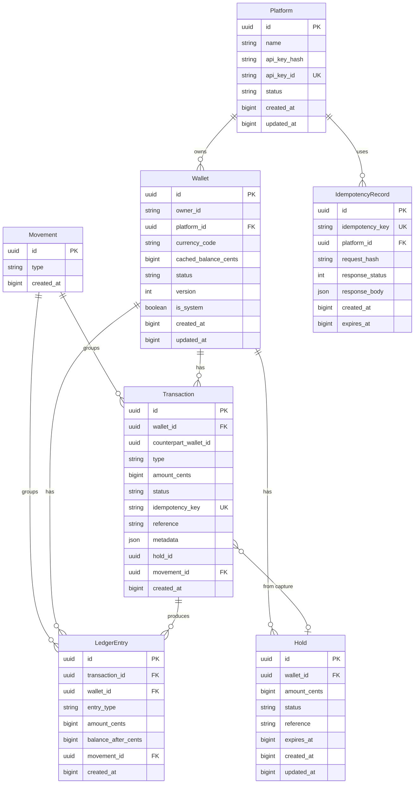

# Data Model — Wallet Service

Conceptual data model for the Wallet Service. Entities and relationships for implementation.

---

## Entity Overview

---

## Entities

### Platform

API consumer that integrates the Wallet Service. Authenticates via API key.

| Field | Type | Notes |
|-------|------|-------|
| id | UUID | Primary key; app generates UUID v7 |
| name | string | Display name for the platform |
| api_key_hash | string | Hashed API key (never store plain) |
| api_key_id | string | Public key identifier (unique) |
| status | string | active, suspended, revoked |
| created_at | BIGINT | Unix ms |
| updated_at | BIGINT | Unix ms |

**Relationships:**
- One platform has many wallets

---

### Wallet

Per-owner, per-platform, per-currency balance container. Uses optimistic locking via `version`.

| Field | Type | Notes |
|-------|------|-------|
| id | UUID | Primary key; app generates UUID v7 |
| owner_id | string | External user ID from platform |
| platform_id | UUID | FK → Platform |
| currency_code | string | ISO 4217 (USD, EUR, etc.) |
| cached_balance_cents | BIGINT | Integer cents; denormalized balance |
| status | string | active, frozen, closed |
| version | int | Optimistic locking; incremented on every mutation (deposit, withdraw, transfer, captureHold, placeHold, voidHold, freeze, unfreeze, close). Intentionally not exposed in the API — clients use idempotency keys for retry, not version numbers |
| is_system | boolean | True for system/omnibus wallets |
| created_at | BIGINT | Unix ms |
| updated_at | BIGINT | Unix ms |

**Unique constraint:** (owner_id, platform_id, currency_code)

**Relationships:**
- Belongs to Platform
- One-to-many Transactions
- One-to-many LedgerEntries
- One-to-many Holds

---

### Movement

Journal entry that groups all transactions and ledger entries for a single financial operation. The accounting unit of atomicity — ledger entries within a movement must always sum to zero.

| Field | Type | Notes |
|-------|------|-------|
| id | UUID | Primary key; app generates UUID v7 |
| type | string | deposit, withdrawal, transfer, hold_capture |
| created_at | BIGINT | Unix ms |

**Audit invariant:** `SUM(amount_cents) GROUP BY movement_id = 0` for all movements.

**Relationships:**
- One-to-many Transactions (1 for most ops, 2 for transfers)
- One-to-many LedgerEntries (always 2: one debit, one credit)

---

### Transaction

Record of a financial operation per wallet. `amount_cents` is always positive; direction implied by `type` and ledger entries.

| Field | Type | Notes |
|-------|------|-------|
| id | UUID | Primary key; app generates UUID v7 |
| wallet_id | UUID | FK → Wallet (primary wallet) |
| counterpart_wallet_id | UUID? | FK → Wallet (for transfers) |
| type | string | deposit, withdrawal, transfer_in, transfer_out, hold_capture |
| amount_cents | BIGINT | Always positive; smallest currency unit |
| status | string | completed, failed, reversed |
| idempotency_key | string? | Unique; for safe retries |
| reference | string? | External reference from caller |
| metadata | JSON? | Arbitrary metadata |
| hold_id | string? | If transaction from captured hold |
| movement_id | UUID | FK → Movement; groups this transaction with its counterpart entries |
| created_at | BIGINT | Unix ms |

**Relationships:**
- Belongs to Wallet
- Belongs to Movement
- One-to-many LedgerEntries

---

### LedgerEntry

Immutable double-entry ledger line. Append-only — DB trigger prevents UPDATE and DELETE.

| Field | Type | Notes |
|-------|------|-------|
| id | UUID | Primary key; app generates UUID v7 |
| transaction_id | UUID | FK → Transaction |
| wallet_id | UUID | FK → Wallet |
| entry_type | string | CREDIT or DEBIT |
| amount_cents | BIGINT | Positive for credit, negative for debit |
| balance_after_cents | BIGINT | Balance snapshot after this entry |
| movement_id | UUID | FK → Movement; entries sharing a movement_id must sum to zero |
| created_at | BIGINT | Unix ms |

**Immutability:** Protected by DB trigger; REVOKE UPDATE/DELETE recommended.

**Relationships:**
- Belongs to Transaction
- Belongs to Wallet
- Belongs to Movement

---

### Hold

Authorization that reserves funds without moving them. Lifecycle: active → captured | voided | expired.

| Field | Type | Notes |
|-------|------|-------|
| id | UUID | Primary key; app generates UUID v7 |
| wallet_id | UUID | FK → Wallet |
| amount_cents | BIGINT | Always positive; integer cents |
| status | string | active, captured, voided, expired |
| reference | string? | Optional reference |
| expires_at | BIGINT? | Unix ms; optional auto-expiry |
| created_at | BIGINT | Unix ms |
| updated_at | BIGINT | Unix ms |

**Expiration**: Detected **on-access** (capture/void checks `expires_at`) and **via cron job** (every 30s, marks holds with `status='active'` and `expires_at < now` as `expired`). Queries (`sumActiveHolds`, `countActiveHolds`, available balance) also filter by `expires_at > now` as defense in depth.

**Relationships:**
- Belongs to Wallet

---

### IdempotencyRecord

Stores response for idempotent mutations. Prevents duplicate financial operations; TTL (e.g., 48h).

| Field | Type | Notes |
|-------|------|-------|
| id | UUID | Primary key; app generates UUID v7 |
| idempotency_key | string | Unique per platform |
| platform_id | UUID | FK → Platform |
| request_hash | string | SHA-256 of request body; for payload mismatch detection |
| response_status | int | HTTP status of original response |
| response_body | JSON | Cached response body |
| created_at | BIGINT | Unix ms |
| expires_at | BIGINT | Unix ms; cleanup after TTL |

**Relationships:**
- Scoped by platform (platform_id)

---

## Cardinalities Summary

| From | To | Relationship |
|------|----|--------------|
| Platform | Wallet | 1:N |
| Movement | Transaction | 1:N (1 for most ops, 2 for transfers) |
| Movement | LedgerEntry | 1:N (always 2: debit + credit) |
| Wallet | Transaction | 1:N |
| Wallet | LedgerEntry | 1:N |
| Wallet | Hold | 1:N |
| Transaction | LedgerEntry | 1:N |
| Transaction | Hold | 0:1 (when type = hold_capture) |
| Platform | IdempotencyRecord | 1:N (logical) |

---

## Notes for Implementation

1. **ID generation — UUID v7 only, from application code**: All entity IDs are UUID v7 (time-ordered). The application generates IDs and provides them on every INSERT. The database does not generate IDs (no `DEFAULT gen_random_uuid()`).

2. **Timestamps**: Unix milliseconds (ms since epoch) everywhere: DB (BIGINT), domain, ports, DTOs, API.

3. **Amounts**: Integer values in the smallest currency unit per ISO 4217 (BIGINT). No floats. Stripe-style representation. The `_cents` column suffix is a naming convention; the actual unit depends on the currency's minor unit exponent (e.g., 2 for USD/EUR, 0 for JPY, 3 for BHD).

4. **System wallets**: `is_system = true`; can have negative balance. Act as counterparty for deposits and withdrawals.

5. **Ledger entries**: Append-only. DB trigger prevents UPDATE and DELETE. Immutable audit trail.

6. **Optimistic locking**: Wallets use `version`; concurrent updates must fail if version mismatch.

7. **Idempotency**: Mutations (deposit, withdraw, transfer, hold capture) require idempotency keys. Store response in `IdempotencyRecord`; return cached response on duplicate key.
